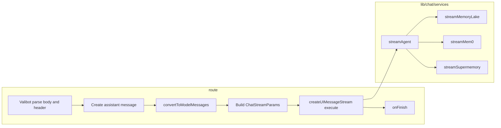

# Chat Route 分发到各 Agent Service + Valibot 参数校验

## 目标

1. **Route 只做入口**：解析与校验（改用 **Valibot**）、写 DB、构造参数、按 agent 分发流、统一 onFinish。
2. **每个 agent 一个 service**：流式逻辑在 `lib/chat/services/<agent>.ts`，便于维护。
3. **接口参数校验与解析使用 Valibot**：body 与必要时的 header 用 schema 定义，统一错误响应。

---

## 一、用 Valibot 做参数校验与解析

### 1.1 依赖

- 安装：`valibot`（无额外运行时，适合 Edge/Node）。

### 1.2 Schema 定义位置与内容

**建议文件**：`lib/chat/schema.ts`（与 types、services 同层，便于 route 与后续复用）。

- **Body schema**
  - `id`: 必填，非空字符串（sessionId）。
  - `messages`: 必填，非空数组；元素为对象：
    - `id`: 可选 string
    - `role`: 枚举 `"user" | "system" | "assistant"`
    - `parts`: 数组，元素 `{ type: string, text?: string }`（或更宽松的 pipe，保证 type 存在即可）
    - `metadata`: 可选对象
  - `agentId`: 必填，字面量联合 `"memorylake" | "mem0" | "supermemory"`（与 `AgentId` 一致）。
  - `modelId`: 可选 string，默认 `"gpt-5-mini"`；可用 `transform` 或二次校验落到 `ModelId`（如用 `isSupportedModelId` 或 Valibot 的 `picklist` 与 `MODEL_IDS`）。
  - `memorylakeProfile`: 可选对象（仅 memorylake 使用），结构可为 `object` + 可选字段 `mem0rgId`, `mem0ProjId`, `datasetId` 等；或与 [lib/memorylake/profile.ts](lib/memorylake/profile.ts) 的 `parseMemorylakeProfile` 对齐，schema 只做“是对象且含若干 string 字段”，具体解析仍用 `parseMemorylakeProfile` 得到 `MemorylakeProfile | undefined`。

- **Header 校验**
  - `x-user-id`: 必填、非空字符串。可在 route 中单独用一个小 schema（如 `pipe(string(), minLength(1))`）校验，或与 body 一起放入一个“请求上下文” schema；校验失败返回 401。

### 1.3 在 Route 中的使用方式

- 从 `req` 取 `x-user-id`，用 Valibot 校验；失败则 `Response.json(..., { status: 401 })`。
- `body = await req.json()` 后，用 `safeParse(chatBodySchema, body)`（或 `parse` 包一层 try/catch）。
- 失败时：根据 Valibot 的 `issues` 返回 400，body 可包含 `{ success: false, message: "...", issues?: ... }` 便于前端展示。
- 成功时：得到类型安全的 `parsed`，从中取 `id`, `messages`, `agentId`, `modelId`, `memorylakeProfile`，再继续“最后一条为 user”等业务规则校验（可仍用 Valibot 的 `check` 或单独 if 判断，保持与现有行为一致）。

### 1.4 与现有逻辑的对应

- 当前 route 中的 `isAgentId`、`sessionIdParam`、`messages.length`、`lastMessage?.role !== "user"` 等，均可由 schema + 若干 `check` 或一次自定义 `refine` 表达；`modelId` 默认值与 fallback 在 schema 的 default 或 transform 中处理。

---

## 二、Route 分发到各 Agent Service（原方案保留）

### 2.1 现状

- 三个 agent 共用 [app/api/chat/route.ts](app/api/chat/route.ts)，在 `createUIMessageStream` 的 `execute` 里用 `if (agentId === "memorylake")` 分支；mem0/supermemory 走 `getModelForAgent` + `streamText` + `toUIMessageStream`。

### 2.2 统一类型与 service 接口

- **`lib/chat/types.ts`**
  - `ChatStreamParams`：`agentId`, `modelId`, `userId`, `modelMessages`, `assistantMessageId`，可选 `memorylakeProfile`。
  - `StreamToWriter`：`(writer, params: ChatStreamParams) => void | Promise<void>`。

### 2.3 各 agent service

- **`lib/chat/services/memorylake.ts`**：检查 ZOOTOPIA 环境变量，调用 `streamMemoryLakeToUIMessageStream`，`writer.merge(uiStream)`。
- **`lib/chat/services/mem0.ts`** / **`lib/chat/services/supermemory.ts`**：`getModelForAgent` + `streamText` + `toUIMessageStream`，`writer.merge(uiStream)`。
- **`lib/chat/services/index.ts`**：`streamAgent(writer, params)` 按 `params.agentId` 分发到上述三个。

### 2.4 Route 瘦身

- 校验与解析：**Valibot**（body + x-user-id）。
- 业务：创建 assistant 消息、`convertToModelMessages`、构建 `ChatStreamParams`；`createUIMessageStream` 的 `execute` 仅调用 `streamAgent(writer, params)`；`onFinish` 不变（更新 session 与消息内容）。

---

## 三、数据流概览

---

## 四、文件清单

| 操作 | 路径 |

|------|------|

| 新增依赖 | `valibot` |

| 新增 | `lib/chat/schema.ts`（Valibot body + 可选 header schema） |

| 新增 | `lib/chat/types.ts`（ChatStreamParams、StreamToWriter） |

| 新增 | `lib/chat/services/memorylake.ts`、`mem0.ts`、`supermemory.ts`、`index.ts` |

| 修改 | `app/api/chat/route.ts`（Valibot 解析 + streamAgent，去掉 agent 分支） |

---

## 五、小结

- **接口参数**：全部用 **Valibot** 做校验与解析（body schema + x-user-id），失败时统一返回 401/400 与可读的 issues。
- **业务流**：Route 只做入口与编排；各 agent 的流式逻辑在 **lib/chat/services** 中按 agentId 分发，便于维护与扩展。
