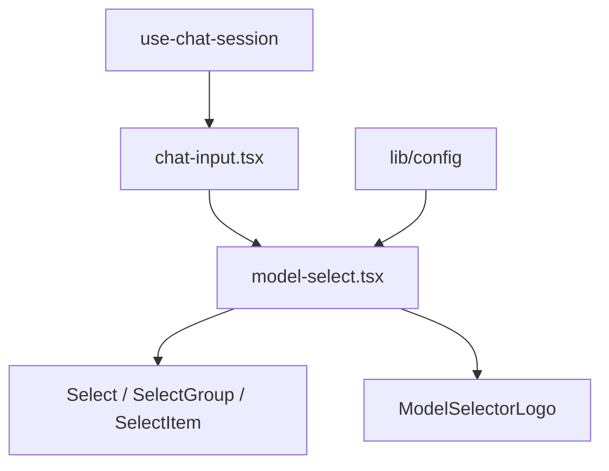

# 模型选择改为 Select（分组 + 图标）+ 独立组件

## 概述

将聊天输入中的模型选择从 Dialog+Command 改为 UI Select，按组展示并带模型图标；**模型选择 UI 抽成独立组件文件**，便于复用与维护。

## 现状

- [components/chat/chat-input.tsx](components/chat/chat-input.tsx) 内联使用 `@/components/ai-elements/model-selector`（Dialog + Command），所有模型在一个 “Models” 组下，无图标。
- [lib/config.ts](lib/config.ts) 中 `ProviderOption` 仅有 `providerId`、`displayName`。
- 已有 [components/ui/select.tsx](components/ui/select.tsx) 和 [ModelSelectorLogo](components/ai-elements/model-selector.tsx) 可复用。

## 实现方案

### 1. 扩展配置：分组 + 图标

**文件**: [lib/config.ts](lib/config.ts)

- `ProviderOption` 增加 `group: string`、`logoProvider: string`。
- `getProviders()` 中为 Claude 系列设 `group: "Anthropic"`, `logoProvider: "anthropic"`；GPT 系列设 `group: "OpenAI"`, `logoProvider: "openai"`。

### 2. 新建独立组件：模型选择 Select

**新文件**: `components/chat/model-select.tsx`

- **职责**：仅负责模型选择的 Select UI（分组 + 图标），不包含聊天输入其它逻辑。
- **Props**：与当前 ChatInput 中模型选择相关一致：
  - `providerId: string`
  - `setProviderId: (id: string) => void`
  - `currentProvider: ProviderOption | undefined`
  - `providers: ProviderOption[]`
  - `open: boolean`
  - `onOpenChange: (open: boolean) => void`
- **实现**：
  - 从 `@/components/ui/select` 引入 Select、SelectTrigger、SelectValue、SelectContent、SelectGroup、SelectLabel、SelectItem。
  - 从 `@/components/ai-elements/model-selector` 仅引入 `ModelSelectorLogo`。
  - 使用 `value={providerId}`、`onValueChange`、`open`、`onOpenChange` 受控。
  - Trigger 内：当前图标（`ModelSelectorLogo` + `currentProvider?.logoProvider`）+ `SelectValue`。
  - Content 内：`useMemo` 按 `provider.group` 分组，每组一个 `SelectGroup` + `SelectLabel`，组内 `SelectItem`（logo + displayName）。
- **导出**：默认导出单组件（如 `ChatModelSelect` 或 `ModelSelect`），类型与 `ProviderOption` 从 `@/lib/config` 引入。

### 3. 聊天输入改为使用独立组件

**文件**: [components/chat/chat-input.tsx](components/chat/chat-input.tsx)

- 移除对 `ModelSelector*`（Dialog/Command 整套）的引用。
- 从新建的 `./model-select`（或 `./model-select.tsx`）引入模型选择组件。
- 在 `PromptInputTools` 中原位置渲染该组件，传入现有 props：`providerId`、`setProviderId`、`currentProvider`、`providers`、`modelSelectorOpen`、`setModelSelectorOpen`（对应组件的 `open` / `onOpenChange`）。

### 4. 数据流（不变）

- `providers`、`providerId`、`setProviderId`、`currentProvider`、`modelSelectorOpen`、`setModelSelectorOpen` 仍由 [use-chat-session.ts](components/chat/use-chat-session.ts) 经 [components/chat/index.tsx](components/chat/index.tsx) 传入 `ChatInput`，再转发给独立模型选择组件。

---

## 文件变更汇总

| 步骤 | 文件 | 说明 |
|------|------|------|
| 1 | `lib/config.ts` | `ProviderOption` 增加 `group`、`logoProvider`；`getProviders()` 为每项赋值 |
| 2 | **新建** `components/chat/model-select.tsx` | Select 实现：分组、图标、受控 value/open，导出单组件 |
| 3 | `components/chat/chat-input.tsx` | 删除内联 ModelSelector，改为引入并渲染独立模型选择组件，透传 props |

## 结构示意

这样模型选择逻辑与 UI 集中在 `model-select.tsx`，后续若在设置页或其它位置复用同一选择器，只需再引用该组件并传入相同 props 即可。
