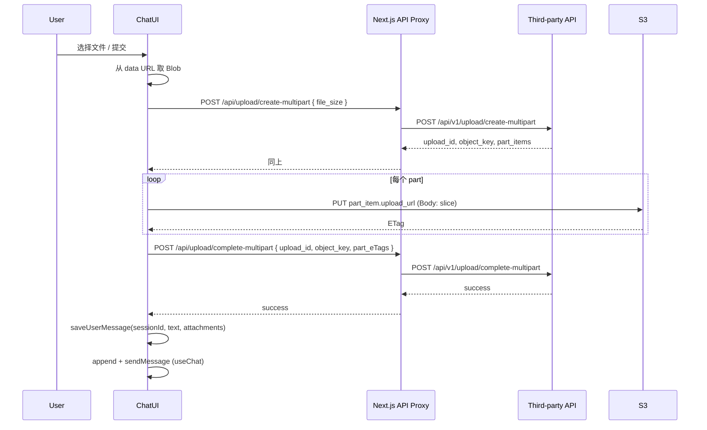

# 分片上传与聊天附件 TODO 实现方案

## 现状摘要

- **[components/chat/index.tsx](components/chat/index.tsx)**：`handleSubmit` 仅使用 `message.text`，未处理 `message.files`；有两处 TODO：`PromptInputHeader` 需展示文件列表、`PromptInputFooter` 需「添加文件」入口。
- **[components/ai-elements/prompt-input.tsx](components/ai-elements/prompt-input.tsx)**：已具备完整附件能力（`usePromptInputAttachments`、`PromptInputActionAddAttachments`、提交时把 blob 转成 data URL 后传入 `onSubmit({ text, files })`）。
- **[app/actions/chat.ts](app/actions/chat.ts)**：`saveUserMessage(sessionId, content)` 未接收 attachments；DB schema 的 `messages.attachments` 已存在且类型为 `Record<string, unknown>[]`。
- 第三方接口需通过 Next.js API Route 代理，避免浏览器直连时的跨域问题。

## 用户补充需求

1. **新会话也允许选择文件**：无 `sessionId` 时用户仍可添加文件；提交时先完成上传，再创建会话并跳转，将附件信息一并带入新会话（通过扩展的 pending 存储）。
2. **需要进度与禁用提交**：上传过程中展示进度（如整体或单文件进度），并禁用提交按钮，防止重复提交。

## 架构与数据流

### 文件不经由我们自己的服务器（必守）

- **目的**：分片上传就是为了减轻服务器压力，因此**文件内容（任意 part 的 body）不得经过我们自己的服务器**。
- **实际数据流**：
  - 我们服务器只转发**小 JSON**：`create-multipart` 的 body 仅 `{ file_size }`，`complete-multipart` 的 body 仅 `{ upload_id, object_key, part_eTags }`。**不接收、不转发任何文件字节。**
  - **每个 part 的 PUT** 必须由**浏览器直连** `part_item.upload_url`（一般为 S3 预签名 URL）；文件字节只走「浏览器 → S3」，不经我们 API。
- **禁止**：不得新增「接收文件流 / part 内容」的 API Route；不得为 part 的 PUT 做代理。若第三方将来返回的 `upload_url` 不是直连 S3 且存在 CORS 限制，应要求第三方提供可直连的预签名 URL 或在其侧解决 CORS，而不是在我们侧代理文件流。

## 实现项

### 1. 环境变量与代理 API

- 新增环境变量（示例）：`ARENA_API_BASE`，指向第三方 base（如 `https://api.example.com`），仅服务端使用。
- 新增两条 Next.js API Route（均在服务端转发，避免跨域）：
  - **POST `/api/upload/create-multipart`**
    - 读取 body `{ file_size: number }`，转发到 `{ARENA_API_BASE}/api/v1/upload/create-multipart`，返回第三方 JSON。
  - **POST `/api/upload/complete-multipart`**
    - 读取 body `{ upload_id, object_key, part_eTags }`，转发到 `{ARENA_API_BASE}/api/v1/upload/complete-multipart`，返回第三方 JSON。
- 未配置 `ARENA_API_BASE` 时，代理可返回 503 或 400，并在前端给出明确错误提示。

### 2. 前端分片上传逻辑

- 新增 **upload 工具模块**（如 `lib/upload/multipart.ts` 或 `lib/upload/client.ts`），实现单文件上传：
  - 入参：`file: Blob`（或 `File`），**`onProgress?: (loaded: number, total: number) => void`**（用于进度回调）。
  - 步骤：
    1. `POST /api/upload/create-multipart`，body `{ file_size: file.size }`。
    2. 按返回的 `part_items` 顺序切分：对每个 part 切片并 `PUT` 到 `upload_url`，从 response headers 读取 `ETag`；**每完成一个 part 调用一次 `onProgress(accumulatedBytes, file.size)`**。
    3. `POST /api/upload/complete-multipart`，body `{ upload_id, object_key, part_eTags }`。

  - 返回：`Promise<{ object_key: string }>`（或包含第三方返回的其它字段）。

- 若 `message.files` 中为 data URL：先用 `fetch(dataUrl).then(r => r.blob())` 得到 Blob 再传入上述函数。

### 3. Chat 组件：UI、进度、禁用提交、新会话带文件

- **PromptInputHeader（TODO: add file list）**
  - 使用 `usePromptInputAttachments()` 取 `files`，若 `files.length > 0` 则渲染列表：每项显示文件名、删除按钮调用 `remove(id)`；样式与现有输入区统一。

- **PromptInputFooter（TODO: add files trigger）**
  - 在 ModelSelector 左侧或合适位置增加「添加文件」入口：使用 `PromptInputActionAddAttachments` 或 `attachments.openFileDialog()` + 隐藏 `input[type=file]`。**无论是否有 sessionId 都显示**，即新会话也可选文件。

- **上传状态与进度（必做：含多文件进度）**
  - 在 Chat 组件内维护：`uploadStatus: 'idle' | 'uploading' | 'done' | 'error'`，以及 **多文件进度** `uploadProgress: { currentFileIndex: number; totalFiles: number; loaded: number; total: number }`（`currentFileIndex` 0-based，表示当前正在传第几份文件；`loaded`/`total` 为当前批次的总已传字节 / 总字节）。
  - 在 `handleSubmit` 中若有 `message.files?.length`：先将 `uploadStatus` 设为 `'uploading'`，`uploadProgress` 初始为 `{ currentFileIndex: 0, totalFiles: files.length, loaded: 0, total: sum(file.size) }`；按文件顺序依次调用上传工具，每文件的 `onProgress(partLoaded, partTotal)` 映射为全局进度并更新 `uploadProgress`（当前文件之前的所有文件大小 + 当前文件已传字节；total 为所有文件大小之和）；全部上传完成后设为 `'done'` 再继续后续逻辑，失败则设为 `'error'` 并展示错误。
  - **UI 必做**：在输入区下方或提交按钮旁展示「上传中 第 x / y 个文件，已传 a / b KB」或等价进度条（总已传 / 总字节）。

- **禁用提交**
  - 当 `uploadStatus === 'uploading'` 时禁用 `PromptInputSubmit`（通过 `disabled` 或 `status` 等已有 prop）；并配合上述多文件进度文案或进度条展示。

- **handleSubmit（含新会话 + 附件）**
  - 若有 `message.files?.length`：先执行上传（带 `onProgress`），失败则提示并 return。
  - **无 sessionId（新会话）**：
    - 上传完成后得到 `attachments: { object_key, filename }[]`；
    - `createSession()` 得到新 `id`；
    - 将 `{ providerId, text, attachments }` 写入 `sessionStorage`（key 仍为 `PENDING_STREAMS_KEY-${id}`）；
    - `router.push(SESSION_PATH_PREFIX + id)`。
  - **有 sessionId**：
    - 上传完成后调用 `saveUserMessage(sessionId, text, attachments)`，然后 `setMessages` + `sendMessage()` 与现有一致。
  - **PendingStreams 扩展**：`PendingStreams` 类型增加可选字段 `attachments?: { object_key: string; filename?: string }[]`。在 `useEffect` 中恢复 pending 时，调用 `saveUserMessage(sessionId, text, attachments)`（传入 attachments），再构造 userMsg 并触发 sendMessage。

### 4. 服务端：saveUserMessage 与 DB

- **[app/actions/chat.ts](app/actions/chat.ts)**：扩展 `saveUserMessage(sessionId, content, attachments?: { object_key: string; filename?: string }[])`；将 `attachments` 转为 DB 所需的 `Record<string, unknown>[]` 并传入 `dbCreateMessage(..., attachments)`。
- **lib/db**：`createMessage` / `NewMessage` 已支持 `attachments`，无需改 schema。

### 5. 类型与错误处理

- 为 create-multipart / complete-multipart 的请求与响应在 `lib/upload/types.ts` 中定义 TypeScript 类型。
- 代理与前端对 4xx/5xx 及第三方返回的 `success: false` 做统一处理，便于 UI 展示（如「上传失败：xxx」）。

### 6. 多文件进度（必做）

- **数据结构**：`uploadProgress: { currentFileIndex: number; totalFiles: number; loaded: number; total: number }`。`currentFileIndex` 为当前正在上传的文件索引（0-based），`totalFiles` 为本次提交的文件总数，`loaded` 为到当前时刻已上传的总字节数，`total` 为所有文件大小之和。
- **更新方式**：多文件按顺序上传；单文件内每完成一个 part 调用 `onProgress(accumulatedBytesInThisFile, file.size)`，在 Chat 侧聚合为「前面所有文件大小 + 当前文件已传字节」写入 `uploadProgress.loaded`，`uploadProgress.total` 在开始上传时固定为 `sum(file.size)`。
- **UI 要求**：上传中必须展示「第 x / y 个文件」及「已传 a / b KB」（或进度条），不得仅展示单文件或无进度。

## 文件清单（建议）

| 变更 | 说明 |

|------|------|

| `.env.example` | 增加 `ARENA_API_BASE=` 说明 |

| `app/api/upload/create-multipart/route.ts` | 代理 POST create-multipart |

| `app/api/upload/complete-multipart/route.ts` | 代理 POST complete-multipart |

| `lib/upload/types.ts` | 请求/响应类型定义 |

| `lib/upload/client.ts` | 分片上传函数（create → PUT parts → complete），支持 onProgress |

| `app/actions/chat.ts` | `saveUserMessage` 增加 `attachments` 参数并写入 DB |

| `components/chat/index.tsx` | 实现两处 TODO；上传状态/进度与禁用提交；扩展 PendingStreams 支持 attachments，新会话提交时先上传再 createSession + 写 pending + 跳转 |

## 与 Chat API 的配合

- 当前 chat route 仅使用 `extractTextFromMessage(lastMessage)`，未使用附件。本方案仅在前端完成「上传 → 存 DB → 发消息」；附件信息保存在 `messages.attachments` 中，便于后续在服务端按 `userMessageId` 查询并消费。

## 注意事项

- `part_eTags` 的 `number` 必须与 create-multipart 返回的 `part_items[].number` 一致；S3 返回的 ETag 常带双引号，complete-multipart 若要求不带引号需在客户端 strip。
- 大文件与并发：可限制同时上传文件数（如一次提交最多 N 个文件），避免内存与请求并发过高。
